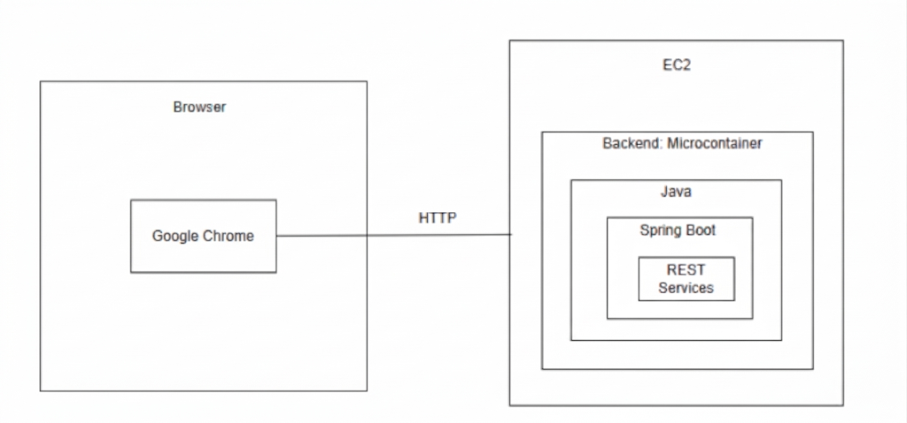
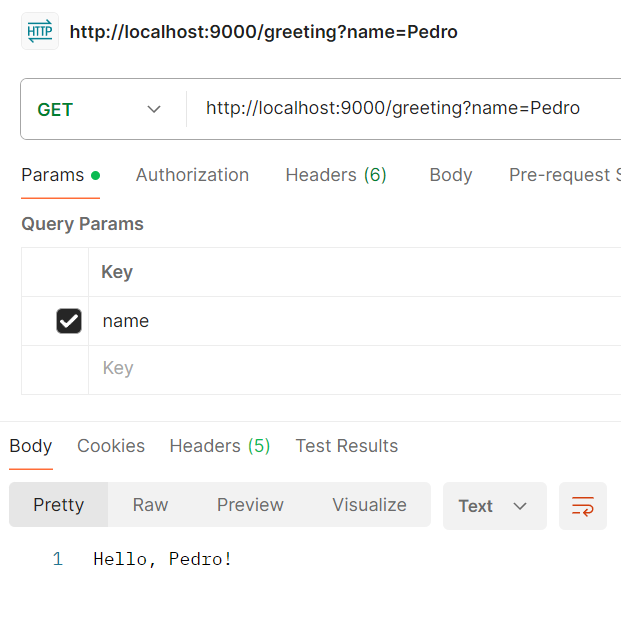
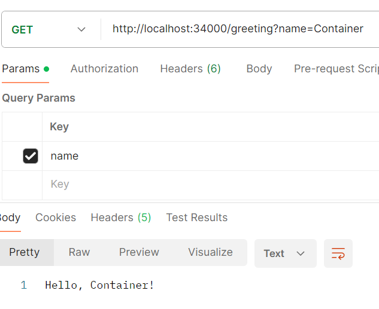
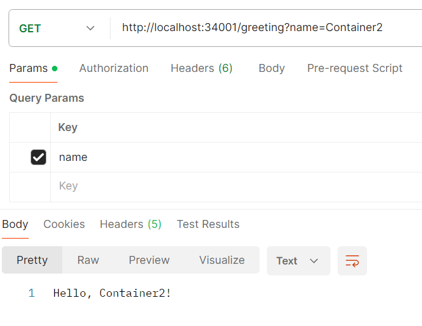
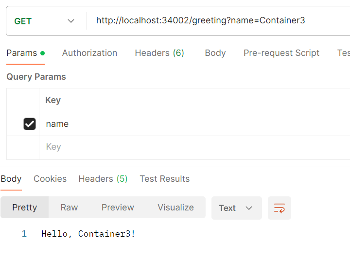
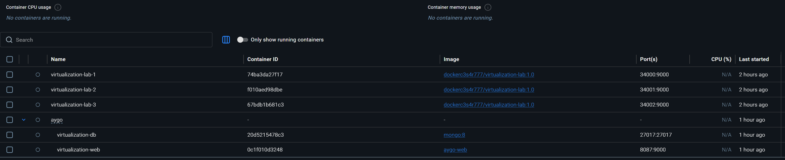
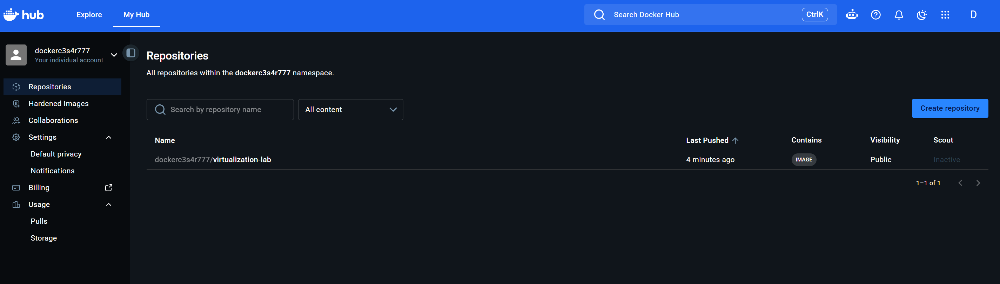
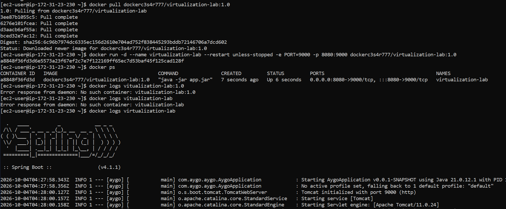
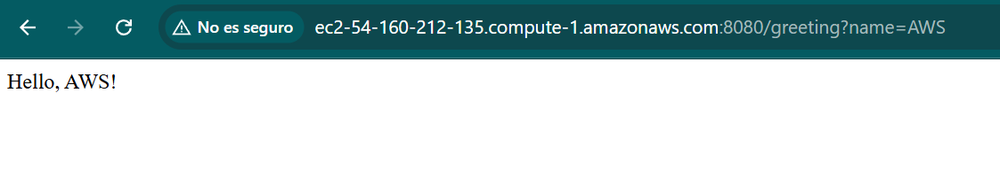

# CloudPractice 💻

### Author: Cesar Fernando Ortiz Rocha

---

[Ver video de demostración](./VideoFuncionamiento.mp4)

## 🔨 Arquitectura

El proyecto implementa un esquema cliente-servidor para la exposición de servicios web en la nube, estructurado de la siguiente forma:

### ***Descripción***

El sistema se compone de un cliente web (Google Chrome) que realiza peticiones mediante el protocolo HTTP hacia un entorno de ejecución hospedado en una máquina virtual Amazon EC2 (AWS). Dentro de la instancia de AWS, se ejecuta un contenedor Docker que aísla la aplicación desarrollada en Java con el framework Spring Boot, exponiendo una API con servicios REST para procesar las solicitudes entrantes. Este enfoque garantiza el desacoplamiento entre el cliente y el backend, optimizando el mantenimiento y la portabilidad del sistema.

## 🔎 Proceso de configuración

1. Construcción del proyecto base: Se estructuró la aplicación en Spring Boot gestionando sus dependencias a través de Apache Maven.
   
2. Validación en entorno local: Se realizó la verificación inicial del servicio ejecutando el empaquetado Java (.jar) directamente sobre la JVM local.

    

3. Contenerización con Docker: Se diseñó el Dockerfile para empaquetar la aplicación y se instanciaron tres contenedores independientes para validar el comportamiento en paralelo.

    
   
    
   
    

4. Orquestación local: Se automatizó el levantamiento de los servicios mediante docker-compose, supervisando el estado y logs de los contenedores en Docker Desktop.

   Resumen del proceso en Docker Desktop.

    

5. Publicación del artefacto: Se creó el repositorio remoto en Docker Hub y se realizó el push de la imagen contenerizada.

    

6. Despliegue en AWS EC2: Se aprovisionó una instancia con Amazon Linux 2023, se configuró el motor de Docker en la máquina virtual y se realizó el pull y run del contenedor para exponer el servicio públicamente.

    
    